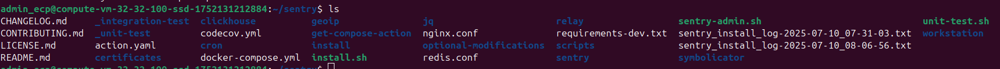
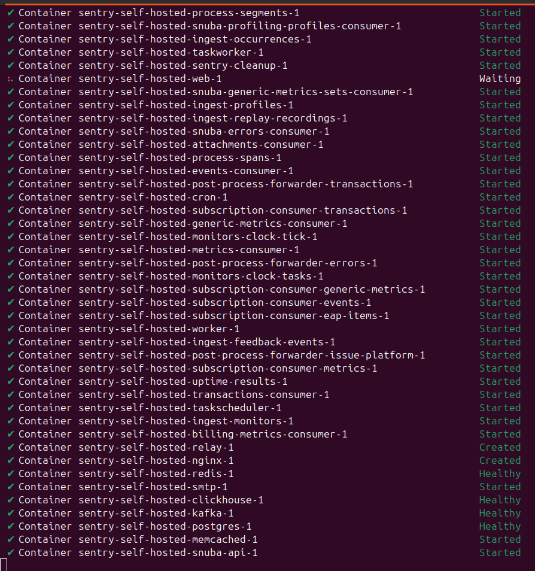
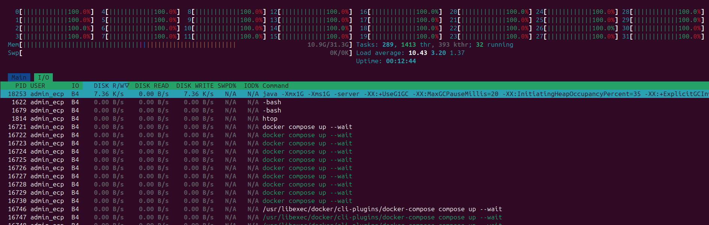
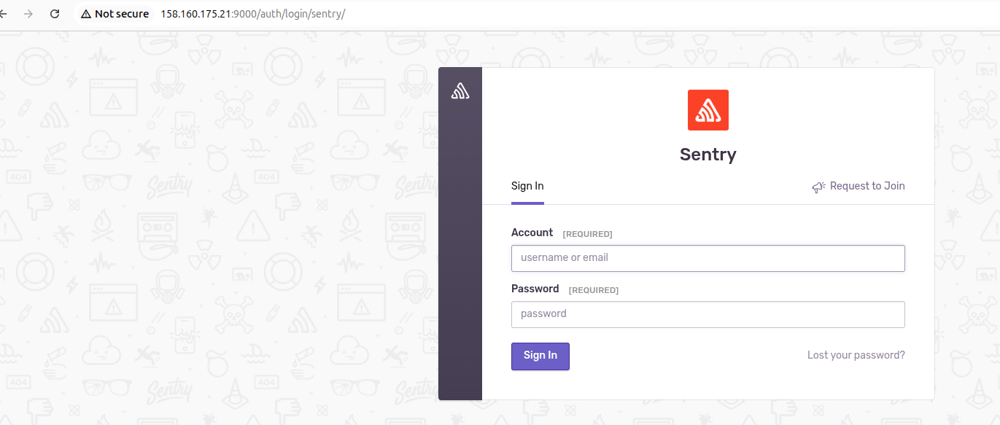
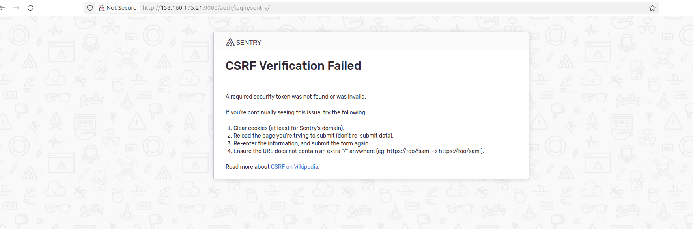
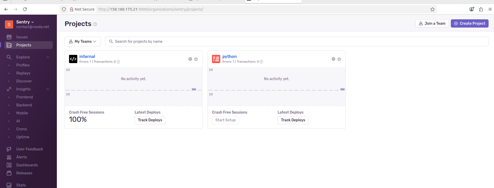
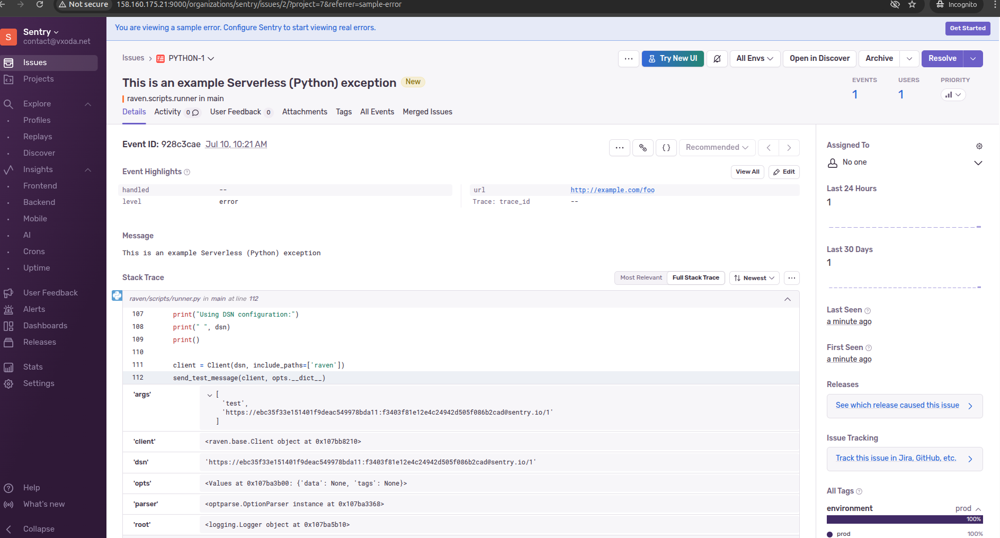
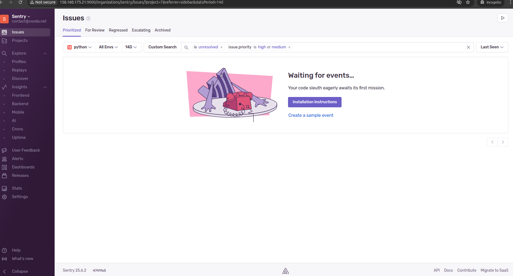
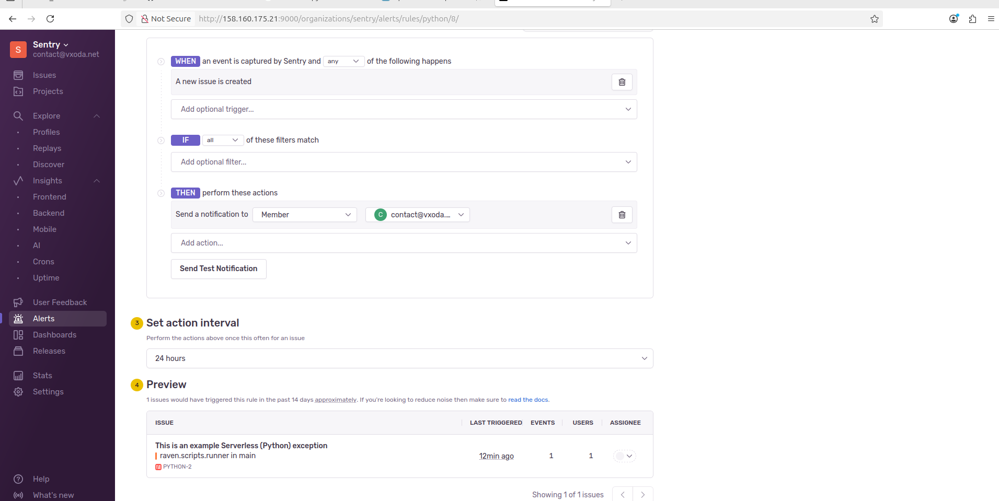

# Домашнее задание к занятию 16 «Платформа мониторинга Sentry» -- Байков Михаил

## Задание 1

Так как Self-Hosted Sentry довольно требовательная к ресурсам система, мы будем использовать Free Сloud account.

Free Cloud account имеет ограничения:

- 5 000 errors;
- 10 000 transactions;
- 1 GB attachments.

Для подключения Free Cloud account:

- зайдите на sentry.io;
- нажмите «Try for free»;
- используйте авторизацию через ваш GitHub-аккаунт;
- далее следуйте инструкциям.

В качестве решения задания пришлите скриншот меню Projects.

### Решение 1
Поскольку коллеги из зарубежных стран не предоставляют доступа к своим сервисам без ВПН было принято решение развернуть локальную версию. Изначально делал попытки собрать 
Self-Hosted Sentry в докер на локальной машине в минимальной комплектации, но он работал криво. Тогда попытался собрать его на ВМ с 8 vcpu, 16Gb RAM, 100Gb HDD. 
Однако ВМ ушла в задумчивость и не вернулась после нескольких часов ожидания. Пересоздал ВМ с 32 vcpu, 32Gb RAM, 100Gb SSD.
1. Устанавливаем докер через `wget --output-document=dockerinstall.sh get.docker.com && chmod u+x dockerinstall.sh && sudo ./dockerinstall.sh`
2. Клонируем проект Sentry `git clone https://github.com/getsentry/self-hosted.git ./sentry && git checkout 25.6.2`

3. Генерируем контейнеры: `SENTRY_IMAGE=getsentry/sentry:25.6.2 ./install.sh`
4. Запускаем контейнеры `docker compose --wait` и ужасаемся потребляемым ресурсам.

5. ~~Успех!~~ Получаем не рабочий проект.

6. Разбираемся с тем что необходимо в `sentry/config.yml` задать `system.url-prefix`
7. Теперь совсем успешный успех!

## Задание 2

1. Создайте python-проект и нажмите `Generate sample event` для генерации тестового события.
2. Изучите информацию, представленную в событии.
3. Перейдите в список событий проекта, выберите созданное вами и нажмите `Resolved`.
4. В качестве решения задание предоставьте скриншот `Stack trace` из этого события и список событий проекта после нажатия `Resolved`.

### Решение 2
Генерируем `Sample event` и выставляем `Resolved`. В итоге в `issues` нет `unresolved` событий.

## Задание 3

1. Перейдите в создание правил алёртинга.
2. Выберите проект и создайте дефолтное правило алёртинга без настройки полей.
3. Снова сгенерируйте событие `Generate sample event`.
Если всё было выполнено правильно — через некоторое время вам на почту, привязанную к GitHub-аккаунту, придёт оповещение о произошедшем событии.
4. Если сообщение не пришло — проверьте настройки аккаунта Sentry (например, привязанную почту), что у вас не было 
`sample issue` до того, как вы его сгенерировали, и то, что правило алёртинга выставлено по дефолту (во всех полях all).
Также проверьте проект, в котором вы создаёте событие — возможно алёрт привязан к другому.
5. В качестве решения задания пришлите скриншот тела сообщения из оповещения на почте.
6. Дополнительно поэкспериментируйте с правилами алёртинга. Выбирайте разные условия отправки и создавайте sample events. 

### Решение 3
Создал правило алертинга, но тут возникла проблема. Поскольку система развернута on-premise почта не работает и данное задание до конца выполнить нет возможности.
Однако по `Preview` видо что на данное событие алерт бы сработал и отправил уведомление.

